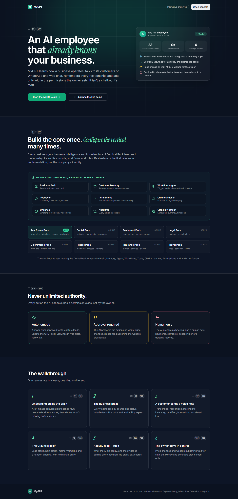
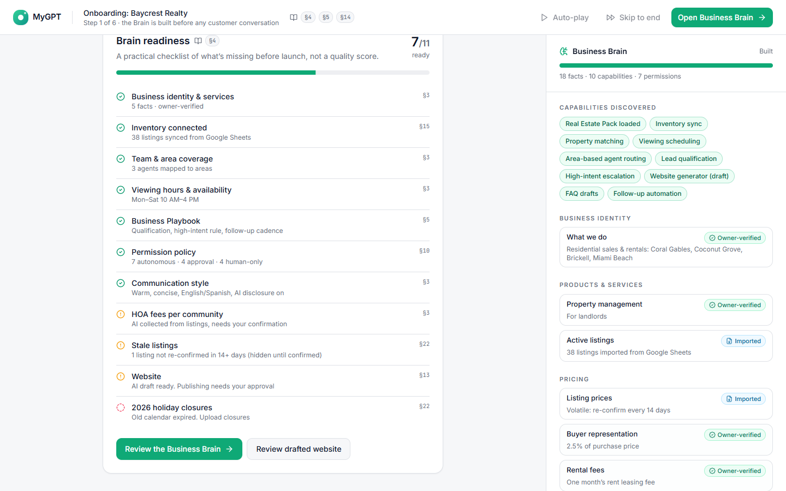
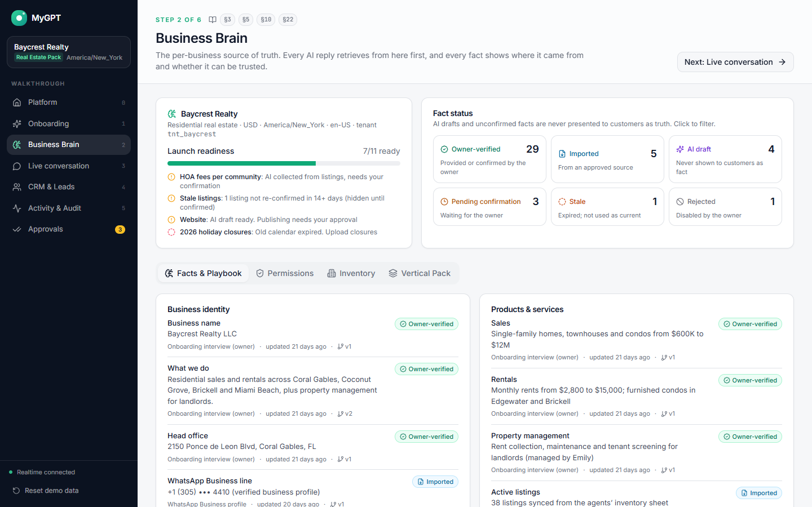
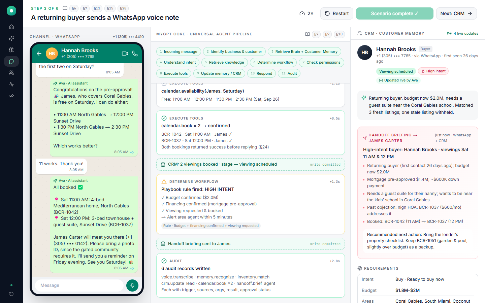
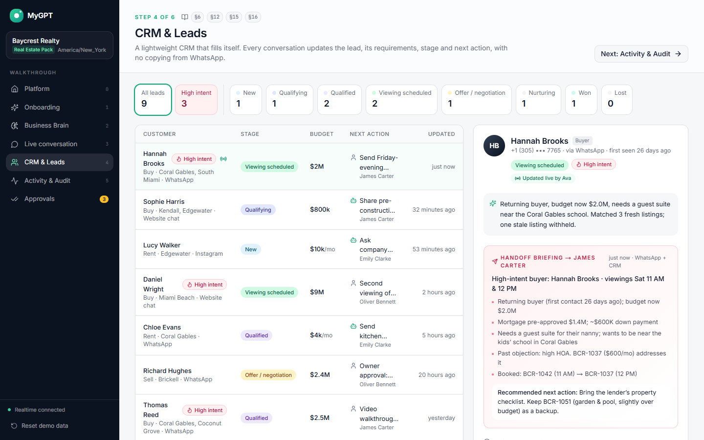
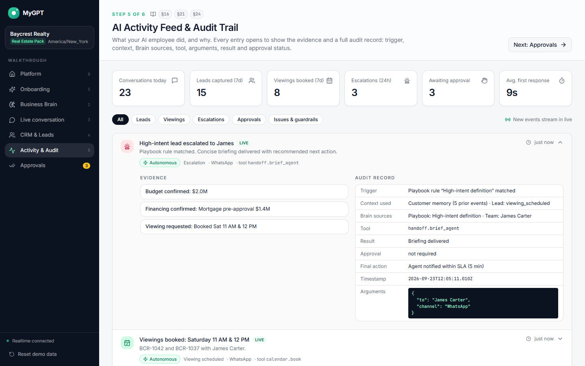
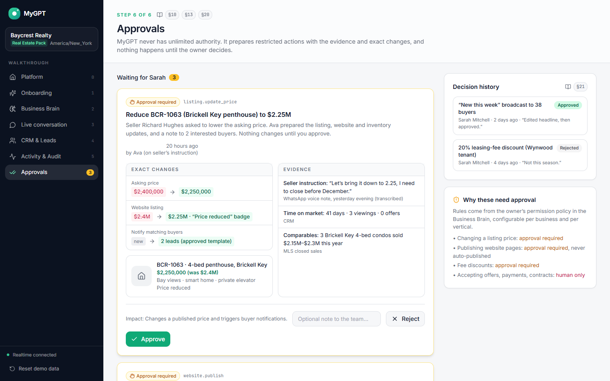

# MyGPT Platform

Universal AI employee platform: **MyGPT Core + Vertical Packs**. One core — business brain, customer
memory, agent pipeline, workflows, tools, permissions, CRM and audit — configured per industry by a
Vertical Pack. This repo is an **interactive prototype** of the end-to-end scenario for a real-estate
business, scaffolded so the real implementation can be layered in without restructuring.

- Architecture notes: [`CLAUDE.md`](CLAUDE.md)
- Walkthrough script: [`docs/demo-script.md`](docs/demo-script.md)

> The detailed product specification this was built from is private; section references (§3, §7, §28…)
> in the code point at it.

## Screens

All data below is seeded and fictional (a demo real-estate agency in Miami).

**The platform — one core, many vertical packs**


**Onboarding builds the Business Brain** — a guided interview turns the owner's answers into structured,
source-tagged facts, ending in a launch-readiness checklist rather than a vanity score.


**Business Brain** — every fact carries its source and status (owner-verified, imported, AI draft,
pending confirmation, stale). Volatile facts such as price and availability expire on a freshness rule.


**Live conversation** — a returning customer's WhatsApp voice note runs through the universal agent
pipeline: transcription, customer recognition, Brain + memory retrieval, inventory matching (stale
listings withheld), permission check, calendar booking, then escalation to a human agent. The CRM on
the right updates as it happens.


**CRM** — leads, stages and next actions maintained by the agent, with a memory timeline and the
handoff briefing sent to the assigned agent.


**Activity feed & audit trail** — every action expands to its evidence and full audit record: trigger,
context used, Brain sources, tool, arguments, result and approval status.


**Approvals** — restricted actions (price changes, publishing a page) are prepared with exact diffs and
evidence, then wait for the owner. Human-only actions such as accepting an offer can't be executed by
the AI at all.


## Quick start (no Docker)

Requires Node 20+ and pnpm 9 (`corepack enable`, or `npm i -g pnpm@9`).

```bash
pnpm install
pnpm dev          # API → http://localhost:4000   UI → http://localhost:3000
```

Open http://localhost:3000. All data is seeded in memory, so no database is required.

| Command | What |
|---|---|
| `pnpm dev` | backend + frontend in parallel |
| `pnpm dev:backend` / `pnpm dev:frontend` | one side only |
| `pnpm typecheck` / `pnpm build` | both packages |
| `pnpm docker:infra` | Postgres (:5433) + Redis (:6380) only |
| `pnpm docker:up` / `pnpm docker:down` | Postgres + Redis + containerised backend |

If port 3000 is taken: `pnpm --filter @mygpt/frontend exec next dev -p 3001`. The API accepts any
`localhost` port in development.

## Hosting (Coolify)

GitHub Pages can't run this (it needs the Express + Socket.IO backend). Use Coolify or any Docker host:

1. Coolify → **New Resource** → your GitHub repo → build pack **Docker Compose**.
2. Compose file location: **`/docker-compose.prod.yml`**.
3. General → **Reload Compose File**, then under **Domains for frontend** click **Generate Domain**
   or enter `https://your.domain:3000` (the `:3000` is the container port). Leave backend empty. Only the frontend is public; it proxies `/api` and
   `/socket.io` to the backend internally, so there is one URL and no CORS setup.
4. Deploy. No env vars required. The demo runs on seeded data (no Postgres/Redis needed).

Test the same setup locally: `docker compose -f docker-compose.prod.yml up --build` (add a port
mapping for `frontend` if you're not behind Coolify's proxy).

## Optional: Docker

```bash
docker compose up -d --build     # postgres:16, redis:7, backend (redis Socket.IO adapter on)
pnpm dev:frontend                # the frontend is not containerised
```

The backend still serves fixtures (`USE_MOCK_DATA=true`) because the Postgres data layer is a stub. Postgres
gets the draft schema from `backend/db/migrations/` on first boot. See CLAUDE.md → *Data layer & env flags*.
